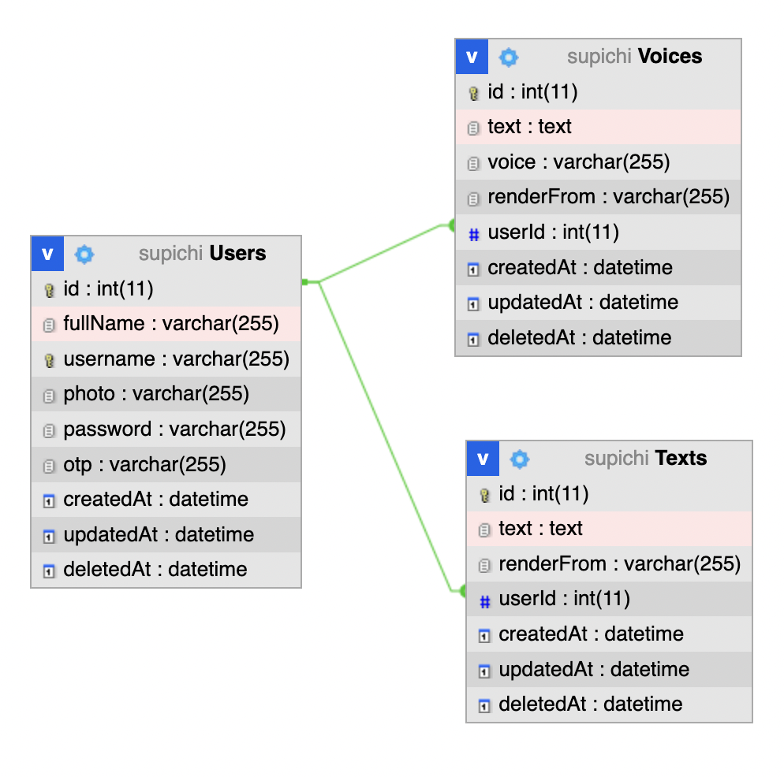

# Supichi API

This is the RESTful API of the Supichi that's written in Nest js.

## Installation 

- Make sure you had clone this repo
- Copy environment from `.env.example` to `.env`
- Configure your `.env` file according to your MySQL credentials
- Open your terminal in this project and run 

	```bash
	npm install
	```

## How To Run This RESTful API

- Create The Supichi Database

	```bash
	CREATE DATABASE supichi CHARACTER SET utf8 COLLATE utf8_general_ci;
	```

- Run On Development

	```bash
	npm run start:dev
	```

- Run On Production

	```bash
	npm run start
	```

## Entity Relationship Diagram (ERD)

[](screenshoot/Supichi-ERD.png)

## API SPECS

- POST `/api/v1/auth/register` Route for register new user

	Request Body

	```
	{
		"fullName": "your fullname",
		"username": "your username",
		"password": "your password"
	}
	```

- POST `/api/v1/auth/login` Route for login

	Request Body

	```
	{
		"username": "your username",
		"password": "your password"
	}
	```
- POST `/api/v1/auth/access-token` Route for generate the access token

	Request Body

	```
	{
		"refreshToken": "your refresh token"
	}
	```
- POST `/api/v1/auth/otp` Route for generate the otp code

	Request Body

	```
	{
		"username": "your username"
	}
	```

- PUT `/api/v1/auth/password` Route for reset the password

	Request Body

	```
	{
		"resetCode": "your reset code",
		"newPassword": "your new password",
		"confirmPassword": "your confirm password"
	}
	```

- PUT `/api/v1/user/photo/:id` Route for upload user photo

	Request Body (Multipart/Form-Data)

	```
	{
		"photo": "blob image",
	}
	```

- PUT `/api/v1/user/:id` Route for update user data

	Request Body 

	```
	{
		"fullName": "your full name",
		"username": "your username"
	}
	```

- POST `/api/v1/voice` Generate Voice

	Request Body (Multipart/Form-Data)

	```
	{
		"language": "the language of the text",
		"renderFrom": "the source of text, camera or image gallery",
		"photo": "blob image"
	}
	```

- POST `/api/v1/text` Generate a Text

	Request Body (Multipart/Form-Data)

	```
	{
		"language": "the language of the text",
		"renderFrom": "the source of text, camera or image gallery",
		"photo": "blob image"
	}
	```

- GET `/api/v1/texts` Get All Texts

	Request Query

	```
	{
		"page": "the page in number",
		"groupByDate": "0 or 1 in number",
		"orderByd": "asc or desc"
	}
	```

- GET `/api/v1/text/:id` Get a text

- DELETE `/api/v1/text/:id` Delete a text

- GET `/api/v1/voices` Get All Voices

	Request Query

	```
	{
		"page": "the page in number",
		"groupByDate": "0 or 1 in number",
		"orderByd": "asc or desc"
	}
	```

- GET `/api/v1/voice/:id` Get a voice

- DELETE `/api/v1/voice/:id` Delete a voice

- GET `/api/v1/voice/download/:id` Download a voice

## License
[MIT](https://choosealicense.com/licenses/mit/)